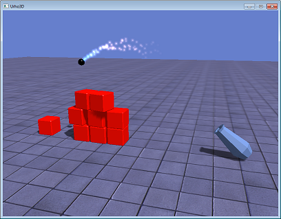
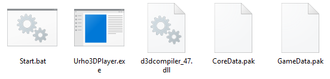

*Данный урок является продолжением урока [Первые шаги](https://github.com/urho3d-learn/first-steps). Если вы с ним ещё не ознакомились, то начните с него. Используется та же версия движка.*

# Редактор Urho3D

В этом уроке рассмотрим редактор. Он достаточно прост в использовании, но некоторые моменты определенно требуют пояснений, а документация их не раскрывает.
Ну и заодно напишем небольшую игрушку. Приступим.



## Редактор тоже игра

Редактор - это скрипт на языке `AngelScript`, выполняемый лаучнером `Urho3DPlayer.exe`, которым мы пользовались в уроке
[Первые шаги](https://github.com/urho3d-learn/first-steps). А значит, его код можно изучать наряду с другими примерами и,
при желании, легко модифицировать. Запустить редактор можно при помощи батника `build_vs/bin/Editor.bat`.

Навигация подобна управлению в шутере. `W` и `S` - перемещение вперед и назад, `A` и `D` - влево и вправо, `Q` и `E` - вниз и вверх.
С зажатым шифтом перемещение быстрее. Можно использовать стрелочки. Зажатая правая кнопка мыши позволяет поворачивать камеру в разные стороны.
При зажатой средней кнопке происходит вращение вокруг выделенного объекта. Если крутить колёсико, то меняется угол обзора (fov).
Полный список клавиш можно посмотреть [тут](https://urho3d-doxygen.github.io/doxygen/_editor_instructions.html).

## Настройки

`View->Editor Settings` - настройка отображения и управления. Для любителей Блендера есть возможность выбрать альтернативную раскладку клавиатуры.
Опция, на которую следует обратить внимание - `New node mode`. По умолчанию включен режим `View center`.
В этом режиме новые ноды создаются в центре экрана на расстоянии, заданном в графе `New node distance`.
Как по мне, это не очень удобно. Мне гораздо больше нравится второй режим - `In center`.
В этом режиме новые ноды создаются в центре координат и их оттуда можно двигать в нужное положение.
Третий режим (`Raycast`) похож на первый, только используется не фиксированное расстояние, а ищется пересечение со сценой.

*Далее в уроке предполагается, что вы активировали режим `In center`.*

`View->Editor Preferences` - настройка интерфейса. Из интересного здесь - возможность выбрать язык (русский в том числе)
и задать прозрачность интерфейса. `Minimum opacity` - прозрачность при перемещении вида, `Maximum opacity` - всё остальное время.
Я обычно устанавливаю оба значения в `1`, ибо отвлекает. Примечание: чтобы новые значения применились, после ввода нажимайте `Enter`.

Все настройки хранятся в файле `c:\Users\ИМЯ_ПОЛЬЗОВАТЕЛЯ\AppData\Roaming\urho3d\Editor\Config.xml` (в Windows).
Чтобы сбросить настройки, этот файл можно удалить.

## Консоль

При нажатии `F1` открывается консоль. Она может работать в двух режимах, переключение между которыми производится с помощью кнопки левее поля ввода.

В режиме `FileSystem` консоль работает как обычная командная строка Windows (если у вас Windows конечно).
Например, если ввести `notepad.exe`, то откроется блокнот.

В режиме `Script` все введённые команды исполняются интерпретатором AngelScript. Например, команда `log.Write(1+2)` выведет 3.
Тут мы приходим к пониманию того, что вывод консоли - это лог. Сам лог в текстовом виде записывается в файл
`c:\Users\ИМЯ_ПОЛЬЗОВАТЕЛЯ\AppData\Roaming\urho3d\logs\Editor.as.log`. Он очень сильно вам поможет при отладке скриптов.

## Первые шаги

Возьмите архив `assets.zip` из этого репозитория и распакуйте его в пустую папку с именем, например, `game`. Этот архив содержит ресурсы, которые понадобятся нам при создании игры: несколько моделей, материалы к ним и один звуковой файл.

В редакторе нажмите `File->Set resource path...` и укажите путь `game\GameData\`. Теперь редактор имеет доступ к трем папкам с ресурсами: собственные папки `Data` и `CoreData`, которые находятся рядом с ним, и папка `GameData`, которую мы указали.

## Создаем сцену

В браузере ресурсов (`Resource Browser`) выделите папку `Models` и перетащите `Ground.mdl` на корневую ноду `Scene` в окне `Hierarchy`.


При этом автоматически будет создана новая нода с компонентом `StaticModel` (простая модель без скелета). В окне `Attribute inspector` задайте для ноды имя `Ground`, нажмите кнопку `Pick` возле графы `Material` и выберите `Materials/Ground.xml`.


Теперь у нас есть пол, но сцена плохо освещена, поэтому давайте добавим источник света.

Для начала создадим новый узел. Выделите корневую ноду `Scene` и выберите пункт меню `Create`->`Local node`. Можно также создавать `Replicated node`. В нашем случае нет никакой разницы, так как реплицируемые ноды синхронизируются при сетевом взаимодействии, а с сетью мы работать не планируем. Ноды также можно создавать не через меню, а с помощью вертикальной панели в левой части редактора.

Убедитесь, что новосозданная нода выделена, и выберите пункт меню `Create`->`Component`->`Scene`->`Light` (многие компоненты продублированы на левой вертикальной панели). В окне `Attribute inspector` задайте имя для ноды, выберите тип источника `Directional` (солнечный свет), укажите яркость, поворот, позицию (для данного типа источника света позиция не имеет значения, но поднимем ноду выше, чтобы не мешала работать со сценой). Также включите опцию `Cast Shadows`, чтобы источник света мог создавать тени.


Теперь изменим фоновое освещение. Выделите корневую ноду `Scene` и создайте компонент `Zone` (`Create`->`Component`->`Scene`->`Zone`). Задайте цвет фона (`Fog Color`) и цвет фонового освещения (`Ambient Color`). Эти значения будут использоваться, только если камера находится в пределах зоны, поэтому расширьте границы (`Bounding Box Min/Max`).


# Скрипты

Создайте новую ноду, добавьте к ней компонент `AnimatedModel` (модель со скелетом) и укажите модель `Models/Cannon.mdl` и материал `Materials/Cannon.xml`. Сдвиньте пушку немного вверх, а также включите опцию Cast Shadows, чтобы пушка отбрасывала тень.


Дочерние ноды, которые вы видите у пушки - это встроенные в модель кости. Пока что не обращайте на них внимания.

В папке `GameData\Scripts` создайте файл `Cannon.as` со следующим содержимым:

```
class Cannon : ScriptObject
{
    // Положительное или отрицательное направление вращения пушки
    int direction = 1;

    // Функция вызывается каждый кадр
    void Update(float timeStep)
    {
        // Угол поворота вокруг оси x (node указывает на ноду, к которой прикреплен скрипт)
        float pitch = node.rotation.pitch;
        
        // Меняем направление вращения, если значение угла выходит за заданные пределы
        if (pitch >= 70.0f)
            direction = -1;
        else if (pitch <= -10.0f)
            direction = 1;
        
        pitch += 30.0f * direction * timeStep;
        node.rotation = Quaternion(pitch, 0.0f, 0.0f);
    }
}
```

Скрипты лучше сохранять в кодировке UTF-8, тогда  не будет проблем с кириллицей.

К ноде `Cannon` добавьте компонент `ScriptInstance` (`Create`->`Component`->`Logic`->`ScriptInstance`). Нажмите на кнопку `Pick` и выберите новосозданный файл, а в графе `Class Name` введите `Cannon` (файл может содержать несколько классов). После ввода не забудьте нажать `Enter`. Если все сделано правильно, ниже имени класса должна появиться переменная `direction`, которую мы объявили в скрипте.

Убедитесь, что переключатель `RevertOnPause` (третья кнопка на верхней панели) активирован и нажмите кнопку `RunUpdatePlay` (первая кнопка на верхней панели). Пушка начнет вращаться туда-сюда. Для остановки нажмите `RunUpdatePause` (средняя кнопка).


Что делает переключатель `RevertOnPause`? Если он активен, то перед запуском состояние сцены запоминается, а при нажатии на паузу состояние восстанавливается до исходного. Эта кнопка нам еще пригодится позже.

В процессе работы не забывайте сохранять сцену (`File`->`Save scene as...`) в файл `GameData/Scenes/Level01.xml`.

## Физика

Urho3D поддерживает две физические библиотеки: Box2D и Bullet. Принципы работы с ними очень похожи, однако первая реализует перемещение нод только в плоскости XY, а вторая в трёхмерном пространстве. Компоненты Box2D находятся в меню `Create`->`Component`->`Physics2D`, а Bullet - в меню `Create`->`Component`->`Physics`.

Итак, у нас есть пол и пушка. Давайте добавим в сцену пушечное ядро. В браузере ресурсов (`Resource Browser`) откройте папку `Models` и перетащите `Cannonball.mdl` в окно `Hierarchy` на корневую ноду `Scene`. Чтобы пушка и пол не мешали работе, в окне `Hierarchy` щелкните по их нодам правой кнопкой мыши и выберите `Enable/disable`. При этом они исчезнут со сцены, а ноды будут окрашены в красный цвет. Теперь дважды щелкните по ноде с ядром и оно (ядро) окажется в центре экрана.


Теперь в браузере ресурсов откройте папку `Materials` и перетащите материал на компонент `StaticModel` в окне `Hierarchy` или в графу `Material` окна `Attribute inspector`. Задайте ноде имя и включите опцию `Cast Shadows`.


Добавьте к пушечному ядру компоненты `RigidBody` и `CollisionShape` (`Create`->`Component`->`Physics`). При этом к сцене будет автоматически добавлен компонент `PhysicsWorld`, который необходим для работы физики.

RigidBody определяет физические свойства объекта. Тела бывают статические и динамические. Статические тела неподвижны и являются лишь препятствиями, а динамические подвержены воздействию внешних сил (гравитации в том числе). Если у тела есть масса - оно динамическое, если масса равна нулю, то тело статическое.

Задайте для RigidBody массу, трение скольжения и трение качения как на скриншоте ниже. Хочу обратить ваше внимание на параметры `CCD Radius` и `CCD Motion Threshold`. Если небольшие объекты на большой скорости проскакивают сквозь преграды, то настройка этих параметров вам поможет.


`CollisionShape` определяет форму объекта, которая используется при расчете столкновений. Почему не использовать саму 3D-модель? В целях оптимизации. Например, чтобы определить пересечение со сферой, достаточно сравнить расстояние до центра сферы и радиус этой сферы. Это гораздо быстрее, чем вычислять пересечения множества треугольников. Объект может содержать несколько шейпов для более точного описания формы.

Выберите для компонента `CollisionShape` тип `Sphere` и установите радиус близким к радиусу пушечного ядра, как на скриншоте выше.

Убедитесь, что переключатель `RevertOnPause` активирован и нажмите кнопку `RunUpdatePlay`. Пушечное ядро под действием гравитации начнет падать вниз. Нажмите паузу и ядро вернется на место.

## Префабы

Тем, кто работал с Unity, будет знакомо это понятие. Префаб - это шаблон объекта, который можно многократно вставлять в сцену. Создайте папку `Objects` в каталоге `GameData`. Выделите ноду `Cannonball`, выберите пункт меню `File`->`Save node as...` и сохраните в файл `GameData/Objects/Cannonball.xml`. Теперь пушечное ядро можно удалить со сцены. Для добавления префабов в сцену используйте пункт меню `File`->`Load node`.

## Пушка, стреляй!

Включите ноды пушки и пола, чтобы их было видно. Создайте для них компоненты `RigidBody` и `CollisionShape`. Для пола выберите тип шейпа `StaticPlane` (бесконечная плоскость) и задайте ему (полу) трение скольжения и трение качения равными единице (иначе тела по нему будут двигаться бесконечно, так как при контакте объектов их коэффициенты трения перемножаются). Для пушки выберите тип шейпа `Capsule` и задайте шейпу (не ноде) размер `Size` = `(2, 4.3, 1)` и смещение `Offset Position` = `(0, 1.12, 0)`. Ещё для пушки добавьте компонент `AnimationController` (`Create`->`Component`->`Logic`), который позволит нам проигрывать созданную в 3D-редакторе анимацию выстрела.

Теперь модифицируем скрипт пушки `GameData\Scripts\Cannon.as`

```
class Cannon : ScriptObject
{
    // Положительное или отрицательное направление вращения пушки
    int direction = 1;

    // Задержка до следующего выстрела
    float shootDelay = 0.0f;

    // Функция вызывается каждый кадр
    void Update(float timeStep)
    {
        // Угол поворота вокруг оси x (node указывает на ноду, к которой прикреплен скрипт)
        float pitch = node.rotation.pitch;

        // Меняем направление вращения, если значение угла выходит за заданные пределы
        if (pitch >= 70.0f)
            direction = -1;
        else if (pitch <= -10.0f)
            direction = 1;

        pitch += 30.0f * direction * timeStep;
        node.rotation = Quaternion(pitch, 0.0f, 0.0f);

        if (shootDelay > 0.0f)
            shootDelay -= timeStep;

        // Если нажат пробел и прошло достаточно времени с предыдущего выстрела,
        if (input.keyDown[KEY_SPACE] && shootDelay <= 0.0f)
        {
            Shoot();             // то стреляем
            shootDelay = 1.0f;   // и вновь устанавливаем задержку в одну секунду

            AnimationController@ animCtrl = node.GetComponent("AnimationController");
            animCtrl.SetTime("Models/Shoot.ani", 0.0f);                 // Перематываем анимацию в начало
            animCtrl.PlayExclusive("Models/Shoot.ani", 0, false, 0.0f); // Запускаем анимацию пушки

            SoundSource3D@ source = node.CreateComponent("SoundSource3D"); // Создаем источник звука
            Sound@ sound = cache.GetResource("Sound", "Sounds/Shoot.wav");
            source.autoRemoveMode = REMOVE_COMPONENT; // Источник звука будет автоматически уничтожен после проигрывания
            source.Play(sound);
        }
    }

    void Shoot()
    {
        // Определяем позицию кости CannonballPlace у пушки
        Vector3 position = node.GetChild("CannonballPlace", true).worldPosition;

        // Добавляем в сцену префаб
        XMLFile@ xml = cache.GetResource("XMLFile", "Objects/Cannonball.xml");
        Node@ newNode = scene.InstantiateXML(xml, position, Quaternion());
        
        // Находим компонент RigidBody
        RigidBody@ body = newNode.GetComponent("RigidBody");
        
        // Изначально у пушечного ядра уже будет импульс, так как ядро частично пересекается с пушкой
        // и стремится оттолкнуться от него. Но нам нужен импульс побольше
        body.ApplyImpulse(node.rotation * Vector3(0.0f, 1.0f, 0.0f) * 15.0f);
    }
}
```
                                                          
Запускаем и наслаждаемся тем, как при нажатии пробела пушка надувается и изрыгает ядра.

Давайте сделаем так, чтобы ядра после десяти секунд своего существования самоуничтожались. Создайте в папке `GameData\Scripts` файл `CannonBall.as` с текстом:

```
class Dying : ScriptObject
{
    float time = 0.0f;

    void Update(float timeStep)
    {
        time += timeStep;
        if (time > 10.0f)
            node.Remove();
    }
}
```
    
Затем загрузите префаб `GameData/Objects/Cannonball.xml` в сцену (`File`->`Load node`->`As replicated/local...`), добавьте к нему компонент `ScriptInstance`, укажите новосозданный файл и введите имя класса `Dying` (не забудьте нажать Enter). Теперь префаб можно сохранить и удалить со сцены. Запустите и посмотрите, как ядра исчезают.

# Заячий городок

Добавим в сцену постройку из кубов, которую мы будем обстреливать из пушки. Как обычно, перетащите модель `GameData/Models/Cube.mdl` на корневую ноду `Scene` и задайте ей материал `GameData/Materials/Cube.xml`. Также включите опцию `Cast Shadows`. Добавьте компонент `RigidBody` (`Mass` = 1, `Friction` = 1, `Rolling Friction` = 0.2) и компонент `CollisionShape` (`Shape Type` = `Box`, `Size` = `(2, 2, 2)`). Разместите куб немного над землей (если вы его погрузите в землю, он будет выпрыгивать при запуске). Убедитесь, что выделена нода, а не компонент, и нажмите Ctrl+D для дублирования куба, а затем сдвиньте копию вбок. Создайте еще одну копию.


Кстати, вы обратили внимание, что в окне `Attribute inspector` все значения, которые отличаются от дефолтных, помечены золотистым цветом?

Теперь выделите весь ряд кубов с зажатой кнопкой Ctrl и продублируйте его целиком. Поднимите копию над первым рядом (не забывайте про зазоры). Затем создайте еще один ряд.


Запустите. У нас возникла такая проблема, что после запуска кубы немного опускаются вниз, но вручную с большой точностью водрузить их друг на друга сложно. И тут нам на помощь придет переключатель `RevertOnPause`. Выключите его, а также отключите компонент `ScriptInstance` у пушки (так же, как мы ранее выключали ноды целиком, только теперь щёлкайте правой кнопкой мыши не по ноде, а по компоненту; другой способ для этого - нажать крестик в окне `Attribute inspector`).


Теперь запустите проигрывание, а когда кубы упадут - остановите. Сцена осталась в новом состоянии. Не забудьте снова включить `RevertOnPause` и `ScriptInstance`.

## Частицы

Создадим для пушечных ядер шлейф из частиц. Откройте редактор частиц через пункт меню `View`->`Particle editor`. Задайте следующие параметры:

* `Direction (min)` = `(-0.1, -0.1, -0.1)`
* `Direction (max)` = `(0.1, 0.1, 0.1)` - эти два значения определяют скорость разлета частиц в разных направлениях (для каждой частицы выбирается случайное значение в заданном диапазоне)
* `Particle Size (min)` = `Particle Size (max)` = `(0.3, 0.3)` - стартовый размер частиц у всех одинаковый
* `Size Add` = `-0.8` - со временем размер частиц уменьшается
* `Number of Particles` = `1000` - максимальное число одновременно существующих частиц
* `Emission Rate (min)` = `Emission Rate (max)` = `80` - частота испускания частиц
* `Relative Transform` = `Выкл.` - чтобы частицы перемещались в мировых координатах, независимо от родительской ноды

Теперь добавим для частиц изменение цвета со временем. Нажмите два раза на кнопку `New` под блоком `Color Frames`, чтобы создать две новые строки и заполните поля как на скриншоте снизу. Первое значение - время, а дальше цвет в формате RGBA.


Нажмите на кнопку `Save As`, сохраните эффект в файл `GameData\Particle\Sparks.xml` и закройте окно редактора частиц. Загрузите префаб с пушечным ядром в сцену, добавьте к нему компонент `ParticleEmitter` (`Create`->`Component`->`Geometry`), укажите новосозданный эффект, сохраните префаб в файл и удалите пушечное ядро со сцены. Игра готова. Не забудьте сохранить сцену.

## Что дальше?

Мы рассмотрели не все возможности редактора. Например, не было сказано ни слова про создание интерфейса или про редактор материалов. Однако, понимая общие принципы, разобраться с ними не составит никакого труда.

Теперь нужно оформить игру  в виде отдельной программы. План очень простой: создаём минимальный скрипт, который загружает и запускает сцену. Но в сцене не хватает камеры, а используется внутренняя камера редактора, которая будет недоступна вне его. Как обычно, создайте новую ноду и добавьте к ней компонент `Camera` (`Create`->`Component`->`Scene`). Обязательно задайте ноде имя `Camera`, чтобы мы могли к ней обратиться в нашем скрипте. Расположите и поверните камеру как вам больше нравится (в этом вам поможет вид из камеры, который появляется в правом нижнем углу). Также к ноде с камерой прикрепите компонент `SoundListener` (`Create`->`Component`->`Audio`), без которого вы не услышите позиционируемых в пространстве звуков. Сохраните сцену и создайте файл `GameData\Scripts\Main.as` со следующим содержимым:

```
Scene@ scene_;

void Start()
{
    scene_ = Scene();
    
    // Загружаем сцену из файла
    scene_.LoadXML(cache.GetFile("Scenes/Level01.xml"));
    
    // Находим в сцене ноду с камерой
    Node@ cameraNode = scene_.GetChild("Camera");
    
    // Указываем движку, что мы хотим смотреть через эту камеру
    Viewport@ viewport = Viewport(scene_, cameraNode.GetComponent("Camera"));
    renderer.viewports[0] = viewport;
    
    // Задаем большой размер теневых карт, чтобы они были более четкие
    renderer.shadowMapSize = 2048;
    
    // Указываем движку приемник звука, через который мы хотим слушать
    audio.listener = cameraNode.GetComponent("SoundListener");
}
```

Скопируйте папку `CoreData`, лаунчер `Urho3DPlayer.exe` и библиотеку `d3dcompiler_47.dll` в папку с игрой. А батник для запуска `Start.bat` у нас уже есть (из архива `assets.zip`). Он указывает лаунчеру папки, в которых содержатся ресурсы игры, размеры окна и стартовый скрипт.

```
start "" Urho3DPlayer.exe Scripts/Main.as -p "GameData;CoreData" -w -x 800 -y 600
```

Итоговый результат находится в этом же репозитории в папке `result`.

## Упаковка ресурсов

Для начала скомпилируем все скрипты командой `ScriptCompiler.exe GameData/Scripts/*.as`. В результате получаем файлы с расширениями .asc. Переместите исходные .as файлы из папки `GameData\Scripts` в другое место, оставив только .asc файлы.

Для упаковки нам понадобится утилита `build_vs\bin\tool\PackageTool.exe`. Выполните команды:

```
PackageTool.exe -pc CoreData CoreData.pak
PackageTool.exe -pc GameData GameData.pak
```

Параметр `p` означает укпаковку. Параметр `c` активирует сжатие файлов (используется скоростной алгоритм <a href="https://en.wikipedia.org/wiki/LZ4_%28compression_algorithm%29">LZ4</a>).

Теперь папки `CoreData` и `GameData` можно убрать. В результате имеем:



Ну и чтобы было совсем красиво, можно избавиться от пакетного файла `Start.bat`. Но для этого нужно модифицировать исходный код лаунчера (он в папке `Urho3D\Source\Tools\Urho3DPlayer`). Не стоит пугаться заранее - исходник лаунчера очень маленький, ведь он занимается только тем, что передает параметры запуска в движок. Вот эти параметры вам и нужно указать. Заодно можно и свой значок для приложения сделать.
